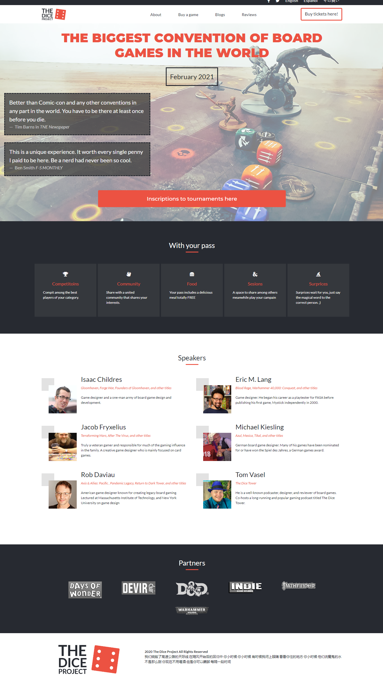

# The Dice Project - Capstone HTML & CSS

> Capstone HTML & CSS- Responsive site made following required characteristics.

**This project is from the Microverses' HTML & CSS curriculum.**
The goal was to build a page based on a website conference, following these instructions:

- Follow the clients' colors, layouts, and design guidelines.
- To have 3 pages as a minimum.
- Responsiveness with one breakpoint

Besides the style, it was made to apply all the knowledge and techniques acquired during the past projects, which are mentioned below.

Here is the link to the original page https://www.behance.net/gallery/29845175/CC-Global-Summit-2015
The Author of this page is [Cindy Shin](https://www.behance.net/adagio07)

## Built With

- HTML & CSS
- Bootstrap
- FlexBox
- Grid
- Visual Studio Code

## Live Demo

[Live Demo Link](https://alejandrono4.github.io/HTML-CSS-Capstone/)

## Getting Started

**To get a local copy up and running follow these simple example steps.**

### Prerequisites

- Github Account
- The last version of Firefox or Google Chrome

### Install

- Clone the Repository to your local machine.

### Usage

- Open the Index file
- Navigate through the connected pages, which are About us, Tickets and the Home page.

## Authors

👤 **Alejandro Contreras Rodriguez**

- GitHub: [@AlejandroNo4](https://github.com/AlejandroNo4)
- Twitter: [@Alejand80002666](https://twitter.com/Alejand80002666)
- LinkedIn: [Alejandro Contreras Rodriguez](https://www.linkedin.com/in/alejandro-contreras-rodriguez-b524821b5/)

## 🤝 Contributing

Contributions, issues, and feature requests are welcome!

Feel free to check the [issues page](https://github.com/AlejandroNo4/HTML-CSS-Capstone/issues).

## Show your support

Give a ⭐️ if you like this project!
